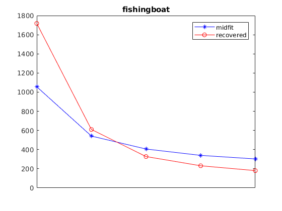
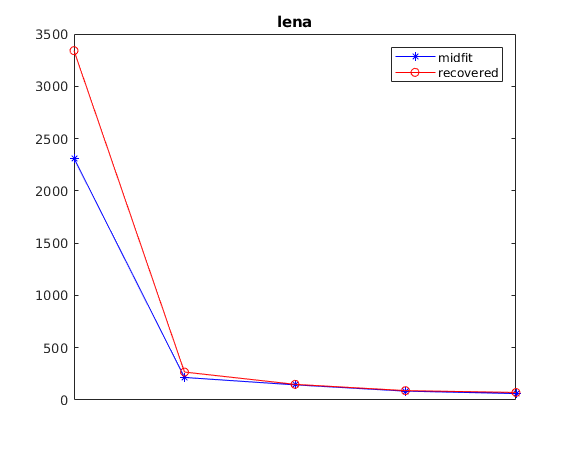

# Final Project: Image Recovery 
---

## Abstract
We present a kind of traditional image recovery with Discrete Cosine Transform(DCT). Besides, we also use the Orthohonal Matching Pursuit(OMP) to speed up the calculation. At the end, in order to compare the efficient of behavior,we give two experiments with different sample points number.

## 1. Overview
In the project, I recovered two images with Discrete Cosine Transform Algorithm. To avoid the mass calculation, I replace the trditional least squares algorithm with Orthohonal Matching Pursuit. Finally, I give some experiments with the analysis about the performance.
## 2. Mathematical Formulation
The core formulation in this project is the Inverse Discrtet Cosine Transform with unknown DCT cofficient, it is as the below
$$g ( x , y ) = \sum _ { u = 1 } ^ { P } \sum _ { y = 1 } ^ { Q } a _ { u } \cdot b _ { v } \cdot G ( u , v ) \cdot \cos \frac { \pi ( 2 x - 1 ) ( u - 1 ) } { 2 \cdot P } \cdot \cos \frac { \pi ( 2 y - 1 ) ( v - 1 ) } { 2 \cdot Q }$$
Here $g(x,y)$ is the pixel of image and $G(u,v)$ is the corresponding DCT coefficient. $a_u$ and $b_v$ is the constant related to the $x,y$ and $u,v$.  
The formulation above could be simplified as $B = A * \alpha$, while the $\alpha$ is the DCT coefficient.  
We could find that the $\alpha$ is a sparse array. It will be costly if we use traditional least squares with under-determined linear system. Such that, we can solve the problem with Orthohonal Matching Pursuit algorithm. The formulation is as below:
$$\begin{array} { c l } { \min _ { \alpha } } & { \| A \alpha - B \| _ { 2 } ^ { 2 } } \\ { \text { S.T. } } & { \| \alpha \| _ { 0 } \leq \lambda } \end{array}$$
Then, we choose the sparse coefficient $\lambda$ of $\alpha$ with cross validation. After choosing the $\lambda$, we find the most related column of A with B, which is iterated $\lambda$ times. In each iteration, we update the pixels $B$ with 
$$B = B - \sum _ { i \in \Omega } \alpha _ { i } \cdot A _ { i }$$
The $a_i$ and $A_i$ is the corresponding value in $\alpha$ and the  related column in the $A$. Such that we could estimate the approximate $\alpha$. We could get the recovered image by $A*\alpha$.
## 3. Experimental Results
We do some experiments with different block size and sample size. For the fishing boat image, we use $8\times8$ block size and $10,20,30,40,50$ for the sample size. For the lena image, we use $16\times16$ block size and $10,30,50,100,150$ for the sample size. I draw a plot about the mean square error between the recovered image and the raw image. I compared the MSE of the recovered and the midfilted.

